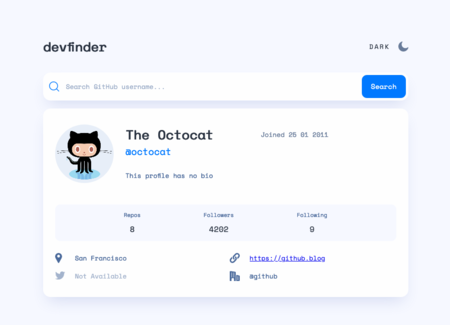
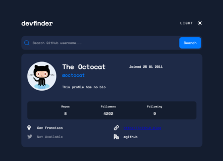
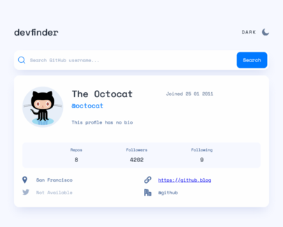
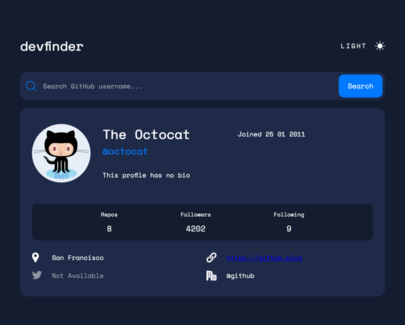

# Frontend Mentor - GitHub user search app solution

This is a solution to the [GitHub user search app challenge on Frontend Mentor](https://www.frontendmentor.io/challenges/github-user-search-app-Q09YOgaH6). Frontend Mentor challenges help you improve your coding skills by building realistic projects.

## Table of contents

TOC goes here

## Overview

### The challenge

Users should be able to:

- View the optimal layout for the app depending on their device's screen size
- See hover states for all interactive elements on the page
- Search for GitHub users by their username
- See relevant user information based on their search
- Switch between light and dark themes
- **Bonus**: Have the correct color scheme chosen for them based on their computer preferences. _Hint_: Research `prefers-color-scheme` in CSS.

### Screenshot

#### Desktop

#### Tablet

#### Mobile

### Links

- Live Site URL: [https://bryce-frontend-mentor-projects.github.io/github-user-search-app/](https://bryce-frontend-mentor-projects.github.io/github-user-search-app/)

## My Process

Probably making this more complicated than I needed to. But I wanted practice using styled components, etc and this seemed like
a good opportunity to do that. Also, get some experience with different data fetching libs, such as SWR.

### Progress

- [x] Mobile styling.
- [x] Tablet styling.
- [x] Desktop styling.
- [x] Fix issue with "No results" formatting in mobile.
- [x] Actual data fetching from github
- [x] Add links to appropriate places

### Built with

- Flexbox
- CSS Grid
- Mobile-first workflow
- [React](https://reactjs.org/) - JS library
- [Styled Components](https://styled-components.com/) - For styles
- [SWR](https://swr.vercel.app/) - React Hooks for Data Fetching
- [React Use](https://github.com/streamich/react-use) - This hooks lib has a handy `useMedia` hook that was used to determine what the current user's color mode (light/dark) is.
- [Webpack](https://webpack.js.org/) - For building and deploying.
- [SVGR](https://react-svgr.com/docs/webpack/) - Transforms SVGs into React Components. Implemented in the webpack build (see `@svgr/webpack` loader)
- [Github Actions](https://github.com/features/actions) - For automating deploying of the website when commited to master

### What I Learned

`input` element for some reason likes to have a minimum size, so made it hard to play nicely in the search bar. Had to wrap it in its own `div` element for it to shrink/grow correctly.

First experience using Github Actions to deploy.

## Author

- Website - [Bryce Fischer](https://github.com/vbfischer)
- Frontend Mentor - [@vbfischer](https://www.frontendmentor.io/profile/vbfischer)
- Twitter - [@vbfischer](https://www.twitter.com/vbfischer)
